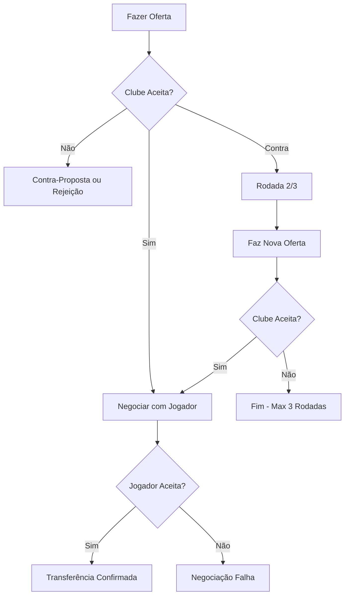

# 📋 DOCUMENTO TÉCNICO DE FEATURES - MAESTRO FOOTBALL MANAGER

**Versão:** 2.0.0  
**Data:** 31/12/2024  
**Status:** Especificação Completa para Implementação  
**Escopo:** MVP v1.0

---

## 📑 ÍNDICE

1. [Visão Geral do Produto](#1-visão-geral-do-produto)
2. [Dashboard](#2-dashboard)
3. [Profile (Manager)](#3-profile-manager)
4. [Squad Management](#4-squad-management)
5. [Staff Management](#5-staff-management)
6. [Finances](#6-finances)
7. [Calendar](#7-calendar)
8. [Competitions](#8-competitions)
9. [Market & Scouting](#9-market--scouting)
10. [Infrastructure](#10-infrastructure)
11. [Match Day](#11-match-day)
12. [Sistemas Integrados](#12-sistemas-integrados)
13. [Notificações & Comunicação](#13-notificações--comunicação)
14. [Referências Técnicas](#14-referências-técnicas)

---

## 1. VISÃO GERAL DO PRODUTO

### 1.1. Conceito

Maestro é um simulador de gestão de futebol single-player focado no mercado brasileiro, onde o jogador assume o papel de treinador de um clube e gerencia todos os aspectos: elenco, finanças, transferências, infraestrutura e táticas.

### 1.2. Progressão de Tempo

- **Unidade Básica:** 1 dia
- **Métodos de Avanço:**
  - Botão "Avançar 1 Dia"
  - Botão "Avançar até Próximo Evento" (mostra loading animado durante simulação)
- **Eventos que Interrompem Simulação:**
  - Partidas do clube
  - Fim de negociações de contrato
  - Youth Intake (chegada de jovens)
  - Lesões em treino
  - Propostas de transferência
  - Mensagens críticas da diretoria

### 1.3. Sistema de Salvamento

- **Auto-Save:** Fim de cada dia (bloqueia interação, indicador centralizado)
- **Save Manual:** Disponível a qualquer momento
- **Limite:** 1 save por jogo (sobrescreve)
- **Migração:** Saves compatíveis entre versões (changelog visível)

---

## 2. DASHBOARD

### 2.1. Layout

```
┌─────────────────────────────────────────────────────────┐
│  [Logo Clube]  CLUBE X          📅 01/07/2024  [+1 Dia] │
├─────────────────────────────────────────────────────────┤
│  ┌─────────────────┐  ┌──────────────┐  ┌─────────────┐ │
│  │ Próxima Partida │  │  Reputação   │  │   Finanças  │ │
│  │                 │  │              │  │             │ │
│  │ vs BENFICA (C)  │  │   7.850/10k  │  │ R$ 15,2M    │ │
│  │ 05/07 - 16h     │  │   ████████░░ │  │ Dívida: 5M  │ │
│  │ Brasileirão     │  │              │  │             │ │
│  └─────────────────┘  └──────────────┘  └─────────────┘ │
├─────────────────────────────────────────────────────────┤
│  📰 NOTÍCIAS (Últimas 5)                                │
│  🏆 [ICON] Flamengo vence Palmeiras por 3x1             │
│  💰 [ICON] São Paulo contrata atacante por R$ 8M        │
│  ⚽ [ICON] Seu clube: Vitória 2x0 sobre Cruzeiro       │
│  📊 [ICON] Tabela atualizada - Você está em 4º          │
│  🔄 [ICON] Jogador X renovou contrato                   │
├─────────────────────────────────────────────────────────┤
│  PARTIDAS RECENTES (Últimas 5)                          │
│  ✅ SEU CLUBE 2 x 0 Cruzeiro - Brasileirão              │
│  ❌ SEU CLUBE 1 x 3 Flamengo - Copa do Brasil           │
│  🟡 SEU CLUBE 1 x 1 Santos - Brasileirão                │
└─────────────────────────────────────────────────────────┘
```

### 2.2. Informações Básicas

**Elementos no Header:**

- Nome do clube
- Escudo (ícone)
- Data atual do jogo (formato: DD/MM/AAAA)
- Botão "Avançar 1 Dia"
- Botão "Avançar até Próximo Evento"

**Card "Próxima Partida":**

- Adversário (nome + C/F para casa/fora)
- Data e horário
- Competição
- Link direto para preparação (se for hoje)

### 2.3. Reputação

- **Escala:** 0 - 10.000 (numérica)
- **Barra Visual:** Preenchimento progressivo
- **Tooltip:** Fatores que influenciam (títulos, desempenho, finanças)

### 2.4. Resumo Financeiro

**Métricas Exibidas:**

- Saldo atual (destaque visual se negativo)
- Dívida histórica
- Gráfico de linha: Evolução do saldo na temporada atual (12 pontos = 12 meses)

### 2.5. Notícias

**Quantidade:** Últimas 5
**Categorias com Ícones:**

- 🏆 Resultados de Partidas
- 💰 Transferências
- 📊 Atualizações de Tabela
- 🔄 Renovações de Contrato
- ⚠️ Lesões/Eventos

**Comportamento:** Não expansível (apenas headline)

---

## 3. PROFILE (MANAGER)

### 3.1. Informações Pessoais

```typescript
interface ManagerProfile {
  name: string;
  nationality: string;
  birthDate: Timestamp;
  reputation: number; // 0-10.000 (independente do clube)
  preferredStyle: string; // "ATTACKING", "DEFENSIVE", "BALANCED"
  preferredFormation: string; // "4-3-3", "4-4-2", etc.
}
```

### 3.2. Histórico de Clubes

**Tabela com Colunas:**
| Clube | Período | Jogos | V | E | D | Aproveitamento % |
|-------|---------|-------|---|---|---|------------------|
| Flamengo | 01/01/2023 - 15/06/2024 | 85 | 50 | 20 | 15 | 70,6% |
| Santos | 01/07/2024 - Atual | 12 | 8 | 2 | 2 | 75,0% |

**Nota:** "Demitido" não aparece explicitamente, apenas período e stats.

### 3.3. Títulos Conquistados

**Tabela Unificada:**
| Temporada | Campeonato | Clube | Tipo |
|-----------|------------|-------|------|
| 2023 | Brasileirão Série A | Flamengo | Campeão |
| 2023 | Copa do Brasil | Flamengo | Vice |
| 2024 | Libertadores | Santos | Semifinalista |

### 3.4. Contrato Atual

**Detalhes Exibidos:**

```yaml
Clube: Santos FC
Salário Mensal: R$ 350.000
Início: 01/07/2024
Expiração: 31/12/2026
Cláusula de Rescisão: R$ 5.000.000

Objetivos da Diretoria (Temporada 2024):
  ✓ Brasileirão: Terminar Top 4
  ✓ Copa do Brasil: Chegar às Quartas
  ✓ Paulistão: Chegar à Final
```

**Objetivos:**

- Definidos no **início da temporada**
- Se assinar contrato durante temporada: objetivos válidos para o **resto daquela temporada**
- **1 objetivo por competição** disputada

### 3.5. Pedir Demissão

**Flow:**

1. Clica em "Pedir Demissão"
2. Modal de confirmação: "Tem certeza? Você ficará desempregado."
3. Se confirmar:
   - Status: "Desempregado"
   - Clube contrata interino (manager IA aleatório)
   - Jogador entra em modo "Aguardando Propostas"
4. **Tempo de Espera:** Variável (depende da IA e situação dos clubes)
5. **Aceleração:** Pode simular dias até receber proposta
6. **Propostas:** Baseadas na reputação do manager
7. **Quantidade:** Não há "rodadas fixas", aparecem conforme demanda da IA

---

## 4. SQUAD MANAGEMENT

### 4.1. Estrutura de Abas

```
┌─────────────────────────────────────┐
│  [Time Principal] [Academia Jovens] │
└─────────────────────────────────────┘
```

### 4.2. Aba: Time Principal

#### 4.2.1. Tabela de Jogadores

**Colunas:**
| Nome | Pos | Idade | OVR | Salário | Moral | Fitness | Status |
|------|-----|-------|-----|---------|-------|---------|--------|
| João Silva | ST | 28 | 85 | R$ 250k | 😊 75 | 💪 90 | 🏥 Lesionado |

**Funcionalidades:**

- Ordenação por coluna (clique no header)
- Filtro por posição (dropdown: Todos, GK, DEF, MID, ATT)
- Badge de lesão (🏥) visível mesmo quando ordenado

**Ação:** Clique na linha → Abre página de detalhes

#### 4.2.2. Página de Detalhes do Jogador

```
┌────────────────────────────────────────────────────────┐
│  [Foto] JOÃO SILVA             Idade: 28   OVR: 85    │
│  Atacante | Brasil | Pé Direito                       │
├────────────────────────────────────────────────────────┤
│  ATRIBUTOS                                             │
│  Finalização: 88  Passe: 75  Velocidade: 82          │
│  Força: 70  Cabeceio: 85  Drible: 78                 │
│  ...                                                   │
├────────────────────────────────────────────────────────┤
│  ESTATÍSTICAS (Temporada 2024)                         │
│  Jogos: 15  Gols: 8  Assistências: 3  Cartões: 2Y    │
│  Rating Médio: 7.5                                     │
├────────────────────────────────────────────────────────┤
│  CONTRATO                                              │
│  Salário: R$ 250.000/mês  Expira: 31/12/2026         │
│  Cláusula: R$ 15M                                      │
├────────────────────────────────────────────────────────┤
│  AÇÕES                                                 │
│  [Colocar na Lista de Transferências]                 │
│  [Oferecer Empréstimo]                                 │
│  [Dispensar (Rescindir Contrato)]                     │
└────────────────────────────────────────────────────────┘
```

**Ações Disponíveis:**

1. **Colocar na Lista de Transferências**

   - Efeito: Aumenta chance de receber ofertas
   - Preço: Calculado automaticamente (valor de mercado)
   - Jogador pode receber ofertas **mesmo fora da lista**
   - Pode remover a qualquer momento

2. **Oferecer Empréstimo**

   - Status: "Disponível para Empréstimo"
   - Clubes interessados fazem propostas automaticamente

3. **Dispensar**
   - Modal de confirmação
   - Paga multa rescisória (proporcional ao tempo restante)
   - Jogador vira Free Agent

### 4.3. Aba: Academia de Jovens

#### 4.3.1. Regras Gerais

- Jogadores **Sub-21**
- Salário **fixo e simbólico** (baixo)
- Aos **21 anos**: Dispensados automaticamente (no dia do aniversário, sem indenização)
- Dispensados viram **Free Agents**

#### 4.3.2. Youth Intake (Leva Anual)

**Quando:** Primeiro dia da nova temporada  
**Quantidade:**

- Nível 1: 5 jogadores
- Nível 100: 30 jogadores
- Fórmula: `5 + (nível * 0.25)`

**Distribuição:** Aleatória entre posições (GK, DEF, MID, ATT)  
**Qualidade:** Nível da Academia afeta Overall e Potential dos jogadores

#### 4.3.3. Tabela de Jovens

**Colunas Adicionais:**
| Nome | Pos | Idade | OVR | **Potential** | Moral | Fitness |
|------|-----|-------|-----|---------------|-------|---------|
| Pedro Costa | CM | 18 | 65 | **85** | 80 | 100 |

#### 4.3.4. Promover Jovem

**Flow:**

1. Clica em "Promover ao Time Principal"
2. Abre tela de **Negociação de Contrato**:
   ```
   ┌────────────────────────────────────┐
   │  NEGOCIAÇÃO DE CONTRATO            │
   │  Jogador: Pedro Costa (18 anos)    │
   ├────────────────────────────────────┤
   │  Salário Mensal: [R$ 50.000] ▲▼   │
   │  Duração: [3 anos] ▲▼              │
   │  Cláusula: [R$ 2M] ▲▼              │
   ├────────────────────────────────────┤
   │  Resposta do Jogador:              │
   │  😊 "Aceito a proposta!"           │
   │                                     │
   │  [Confirmar] [Cancelar]            │
   └────────────────────────────────────┘
   ```
3. Jovem pode **recusar** se proposta for ruim (salário muito baixo)
4. Se aceitar: Move para Time Principal + Cria `Contract`

**Proteção:** Outros clubes **não podem contratar** jovens diretamente (só se dispensados)

---

## 5. STAFF MANAGEMENT

### 5.1. Tipos de Funcionários

| Função                 | Impacto Principal                           | Atributos          |
| ---------------------- | ------------------------------------------- | ------------------ |
| **Assistente Técnico** | Moral dos jogadores + Resultado de partida  | Overall, Potential |
| **Preparador Físico**  | Reduz fadiga e risco de lesão               | Overall, Potential |
| **Médico**             | Acelera recuperação de lesões               | Overall, Potential |
| **Olheiro**            | Qualidade e velocidade do scouting          | Overall, Potential |
| **Analista de Dados**  | Bônus na preparação de partidas             | Overall, Potential |
| **Administrador**      | Reduz custos operacionais, melhora receitas | Overall, Potential |

**Nota:** Sem especialidades, apenas Overall (1-100) e Potential (1-100)

### 5.2. Tabela de Staff

**Colunas:**
| Nome | Função | Overall | Salário | Contrato Expira |
|------|--------|---------|---------|-----------------|
| Carlos Mendes | Médico | 78 | R$ 30.000 | 31/12/2025 |

### 5.3. Múltiplos Funcionários

- **Limite:** Sem limite máximo
- **Benefício:** Diminishing returns
  - 1º Médico (OVR 80): +20% recuperação
  - 2º Médico (OVR 70): +10% recuperação
  - 3º Médico (OVR 60): +5% recuperação
  - **Total:** +35% (não soma linearmente)

### 5.4. Contratação

- **Local:** Aba MARKET (mesma interface de buscar jogadores)
- **Filtros:** Função, Overall, Idade
- **Processo:** Apenas negociação de contrato (sem entrevista)
- **Aceitação:** Staff com Overall alto exige clubes com reputação alta

### 5.5. Renovar/Dispensar

- **Renovação:** Abre negociação (pode rejeitar e sair de graça)
- **Dispensa:** Rescisão imediata (paga multa proporcional)

---

## 6. FINANCES

### 6.1. Visão Geral

```
┌─────────────────────────────────────────────────┐
│  SALDO ATUAL: R$ 15.200.000                     │
│  DÍVIDA HISTÓRICA: R$ 5.000.000                 │
│  SALDO ACUMULADO (Gestão): +R$ 3.000.000        │
├─────────────────────────────────────────────────┤
│  [Pagar Parte da Dívida] (Se saldo positivo)    │
└─────────────────────────────────────────────────┘
```

### 6.2. Categorias de Receita

| Categoria               | Frequência  | Detalhes                                                                               |
| ----------------------- | ----------- | -------------------------------------------------------------------------------------- |
| **Bilheteira**          | Por partida | Depende: Capacidade × Taxa de ocupação × Preço do ingresso × Importância da competição |
| **Patrocínios**         | Mensal      | Contratos fixos (tabela `Sponsorship`)                                                 |
| **Prêmios**             | Pontual     | Vitórias, classificações, títulos                                                      |
| **Vendas de Jogadores** | Pontual     | Transferências confirmadas                                                             |
| **Sócios**              | Mensal      | Variável (depende de desempenho/reputação)                                             |

**Exemplo de Bilheteira:**

- Estádio: 40.000 lugares
- Ocupação: 85% = 34.000 presentes
- Ingresso Série A: R$ 95
- **Receita:** R$ 3.230.000

**Ingresso por Competição:**

- Série A: R$ 95
- Série B: R$ 60
- Copa do Brasil: R$ 120
- Libertadores: R$ 150

### 6.3. Categorias de Despesa

| Categoria                        | Frequência      | Detalhes                          |
| -------------------------------- | --------------- | --------------------------------- |
| **Salários (Jogadores)**         | Mensal          | Soma de todos os contratos        |
| **Salários (Staff)**             | Mensal          | Soma de todos os contratos        |
| **Manutenção de Infraestrutura** | Mensal (dia 1º) | Baseado no nível de cada infra    |
| **Juros da Dívida**              | Mensal          | Taxa fixa sobre `debt_historical` |
| **Contratações**                 | Pontual         | Taxas de transferência            |
| **Rescisões**                    | Pontual         | Multas contratuais                |

### 6.4. Sistema de Dívida

#### 6.4.1. Mecânica

```typescript
// Durante a temporada
if (balance_current < 0) {
  // Clube continua operando normalmente
  // Gera entrada negativa em FinancialEntry
}

// Fim da temporada
const accumulated_balance = balance_at_season_end - balance_at_season_start;
if (accumulated_balance < 0) {
  debt_historical += Math.abs(accumulated_balance);
  // Na próxima temporada: cobra juros mensais sobre debt_historical
}

// Taxa de juros (exemplo)
const monthly_interest = debt_historical * 0.01; // 1% ao mês = 12% ao ano
```

#### 6.4.2. Cobrança da Diretoria

- **Saldo Acumulado Negativo:** Reduz `board_confidence`
- **Dívida crescente:** Pressão aumenta
- **Demissão:** Se `board_confidence < 20` por 3 meses consecutivos

#### 6.4.3. Pagamento Antecipado

- Disponível **durante a temporada** (se saldo positivo)
- Reduz `debt_historical` imediatamente
- Não cobra penalidade

### 6.5. Campanha de Sócios

**Botão:** "Iniciar Campanha de Marketing"

**Regras:**

- **Custo:** R$ 500.000 (investimento fixo)
- **Duração:** 1 mês (30 dias)
- **Limite:** Máximo de 2 campanhas por temporada
- **Sucesso:** Depende de:
  - Reputação do clube
  - Resultados recentes (últimas 10 partidas)
  - Fase da temporada (início > meio > fim)

**Resultado:**

```typescript
const base_increase = 5000; // Novos sócios
const reputation_multiplier = club.reputation / 10000; // 0.0 - 1.0
const performance_multiplier = recent_wins / 10; // 0.0 - 1.0

const new_members =
  base_increase * reputation_multiplier * performance_multiplier;
// Adiciona à receita mensal futura
```

### 6.6. Movimentações (FinancialEntry)

**Lista:**

```
┌────────────────────────────────────────────────────┐
│  MOVIMENTAÇÕES (Temporada 2024)                    │
├────────────────────────────────────────────────────┤
│  05/07  Bilheteira - vs Flamengo     +R$ 3.200.000│
│  03/07  Salários (Jogadores)         -R$ 8.500.000│
│  01/07  Manutenção Infraestrutura    -R$   250.000│
│  30/06  Patrocínio Nike              +R$ 1.000.000│
│  ...                                               │
│  [Scroll Infinito - Últimos 12 meses]             │
└────────────────────────────────────────────────────┘
```

**Filtros:** Nenhum (scroll simples)  
**Limite Temporal:** Última temporada (12 meses)  
**Saldo após transação:** Não exibido

---

## 7. CALENDAR

### 7.1. Visualização

**Formato:** Lista/Tabela (não calendário visual)

```
┌──────────────────────────────────────────────────────────┐
│  CALENDÁRIO - TEMPORADA 2024                             │
├──────────────────────────────────────────────────────────┤
│  05/07  vs FLAMENGO (F)  Brasileirão  16:00  ❌ 1x3     │
│  08/07  vs SANTOS (C)    Copa BR      19:00  ✅ 2x0     │
│  12/07  vs CRUZEIRO (F)  Brasileirão  18:30  [Agendado] │
│  15/07  vs GRÊMIO (C)    Brasileirão  20:00  [Agendado] │
│  ...                                                     │
└──────────────────────────────────────────────────────────┘
```

**Colunas:**

- Data
- Adversário (C = Casa, F = Fora)
- Competição
- Horário
- Resultado (se já jogado: Placar + V/E/D)

### 7.2. Simulação Rápida

**Botão:** "Simular até Próximo Evento"

**Comportamento:**

- Mostra loading com animação ("dias passando")
- **Para imediatamente** no dia do evento
- Se múltiplos eventos no mesmo dia: **processa todos** antes de parar

**Eventos Importantes:**

- Partida do clube
- Fim de negociação (transferência, renovação)
- Youth Intake
- Lesão em treino
- Proposta de transferência crítica
- Mensagem urgente da diretoria

### 7.3. Filtros

- **Nenhum** (mostra apenas jogos do próprio clube)
- Jogos de outros clubes: Visíveis na aba **COMPETITIONS**

---

## 8. COMPETITIONS

### 8.1. Competições Disponíveis

| Tipo                    | Nome                     | Níveis           | Formato                    |
| ----------------------- | ------------------------ | ---------------- | -------------------------- |
| **Campeonato Nacional** | Brasileirão              | Série A, B, C, D | Pontos Corridos            |
| **Copa Nacional**       | Copa do Brasil           | Único            | Eliminatório (Mata-Mata)   |
| **Campeonato Estadual** | Paulistão, Carioca, etc. | Único            | Misto (Grupos + Mata-Mata) |
| **Copa Continental**    | Libertadores             | Único            | Grupos + Mata-Mata         |
| **Copa Internacional**  | Mundial de Clubes        | Único            | Eliminatório               |

### 8.2. Tabela de Classificação

```
┌────────────────────────────────────────────────────────────┐
│  BRASILEIRÃO SÉRIE A - 2024                    Rodada 15/38│
├────────────────────────────────────────────────────────────┤
│  Pos│ Time           │ J │ V│ E│ D│ GM│GC│ SG│ Pts│        │
├────────────────────────────────────────────────────────────┤
│  1  │ 🏆 FLAMENGO     │15│10│ 3│ 2│32│15│+17│ 33│ [Campeão]│
│  2  │ 🌎 PALMEIRAS    │15│ 9│ 4│ 2│28│12│+16│ 31│ [Liberta]│
│  3  │ 🌎 SÃO PAULO    │15│ 8│ 5│ 2│25│13│+12│ 29│ [Liberta]│
│  4  │ 🌎 **SEU CLUBE**│15│ 8│ 4│ 3│24│14│+10│ 28│ [Liberta]│
│  ...                                                       │
│ 17  │ ⚠️ BAHIA        │15│ 4│ 3│ 8│15│25│-10│ 15│ [Z-4]    │
│ 18  │ ⬇️ CORITIBA     │15│ 3│ 4│ 8│12│23│-11│ 13│ [Rebaixa]│
└────────────────────────────────────────────────────────────┘
```

**Zonas Destacadas:**

- 🏆 Campeão (1º)
- 🌎 Libertadores (2º-4º)
- 🏆 Sul-Americana (5º-8º)
- ⚠️ Zona de Perigo (Z-4: 17º)
- ⬇️ Rebaixamento (18º-20º)

**Clique no Time:** Abre página de detalhes do clube

### 8.3. Detalhes do Clube Rival

**Página:**

```
┌────────────────────────────────────────────────┐
│  FLAMENGO                                      │
│  [Escudo] Reputação: 9.500                     │
├────────────────────────────────────────────────┤
│  INFORMAÇÕES BÁSICAS                           │
│  Fundado: 1895                                 │
│  Cidade: Rio de Janeiro                        │
│  Estádio: Maracanã (78.000)                    │
├────────────────────────────────────────────────┤
│  HISTÓRICO DE COMPETIÇÕES                      │
│  2023 - Brasileirão: Campeão                   │
│  2023 - Libertadores: Semifinalista            │
│  2022 - Brasileirão: 3º lugar                  │
├────────────────────────────────────────────────┤
│  ELENCO (Com Fog of War)                       │
│  [?] Jogador 1 - ST - OVR: ??                  │
│  [?] Jogador 2 - MID - OVR: ??                 │
│  (Precisa fazer scout para ver detalhes)       │
└────────────────────────────────────────────────┘
```

**Fog of War:** Sem scouting, jogadores aparecem como "???"

### 8.4. Histórico de Campeões

**Tabela:**

```
┌────────────────────────────────────────────────┐
│  HISTÓRICO - BRASILEIRÃO SÉRIE A               │
├────────────────────────────────────────────────┤
│  Ano │ Campeão    │ Artilheiro (Gols) │        │
├────────────────────────────────────────────────┤
│ 2024 │ FLAMENGO   │ Pedro (28 gols)  │        │
│ 2023 │ PALMEIRAS  │ Rony (22 gols)   │        │
│ 2022 │ ATLÉTICO-MG│ Hulk (31 gols)   │        │
└────────────────────────────────────────────────┘
```

**Critério Artilheiro (Empate):** Menos minutos/partidas jogadas

### 8.5. Resultados da Temporada

**Agrupado por Rodada:**

```
┌────────────────────────────────────────────────┐
│  RODADA 15 - BRASILEIRÃO SÉRIE A               │
├────────────────────────────────────────────────┤
│  Flamengo 3 x 1 Palmeiras                      │
│  ⭐ SEU CLUBE 2 x 0 Santos                     │
│  Cruzeiro 1 x 1 Grêmio                         │
│  ...                                           │
├────────────────
────────────────────────────────┤
│  RODADA 14 ...                                 │
└────────────────────────────────────────────────┘
```

**Fase de Grupos (Libertadores):**

- Mostra **todos os grupos** simultaneamente
- Não destaca grupo do clube (tratamento igual)

---

## 9. MARKET & SCOUTING

### 9.1. Sistema de Scouting

#### 9.1.1. Slots de Scouting

- **Limite:** 3 scouts ativos simultaneamente
- **Cancelamento:** Pode cancelar antes de terminar (sem penalidade)

#### 9.1.2. Tipos de Scout

**A) Scout Geral (Busca Ampla)**

```
┌────────────────────────────────────────────────┐
│  INICIAR SCOUT GERAL                           │
├────────────────────────────────────────────────┤
│  Posição: [Atacante ▼]                         │
│  Idade: [18] - [30]                            │
│  Overall Mínimo: [70]                          │
│  País: [Todos ▼]                               │
│                                                │
│  Duração Estimada: 5 dias                      │
│  [Iniciar Scout]                               │
└────────────────────────────────────────────────┘
```

**Resultado:** Lista de 10-20 jogadores (knowledge variável: 20-60)

**B) Scout Específico (Jogador Alvo)**

```
┌────────────────────────────────────────────────┐
│  SCOUT ESPECÍFICO: Pedro Silva                 │
│  Clube: Flamengo | Posição: ST | OVR: ??      │
│                                                │
│  Knowledge Atual: 25/100                       │
│  Duração: 7 dias                               │
│  [Iniciar Scout Específico]                    │
└────────────────────────────────────────────────┘
```

**Resultado:** Knowledge sobe gradualmente (25 → 45 → 65 → 85 → 100)

#### 9.1.3. Knowledge Level (0-100)

| Nível      | Informações Reveladas                                                      |
| ---------- | -------------------------------------------------------------------------- |
| **0-20**   | Nome, Posição, Idade aproximada                                            |
| **21-50**  | + Clube atual, Overall, Nacionalidade                                      |
| **51-80**  | + Atributos básicos (6 principais), Salário estimado                       |
| **81-100** | + Todos atributos, Histórico, Valor de mercado exato, Posições secundárias |

#### 9.1.4. Validade da Lista

- Scout geral: Lista válida por **7 dias**
- Após expirar: Precisa fazer novo scout
- Knowledge específico: **Permanente** (não expira)

#### 9.1.5. Influência de Olheiros

**Overall do Olheiro:**

- **Alto (80+):** Scout termina em 3-4 dias + Lista com 20 jogadores
- **Médio (60-79):** Scout termina em 5-6 dias + Lista com 15 jogadores
- **Baixo (<60):** Scout termina em 7-8 dias + Lista com 10 jogadores

**Múltiplos Olheiros:** Diminishing returns (mesmo sistema de staff)

### 9.2. Buscar Jogadores

**Interface:**

```
┌────────────────────────────────────────────────────────┐
│  MERCADO DE JOGADORES                                  │
├────────────────────────────────────────────────────────┤
│  [Scout Geral] [Scout Específico] [Agentes Livres]    │
├────────────────────────────────────────────────────────┤
│  FILTROS:                                              │
│  Posição: [Todos ▼]  Idade: [18-35]  Pé: [Todos ▼]   │
│  Ordenar por: [Overall ▼]                              │
├────────────────────────────────────────────────────────┤
│  🔍 RESULTADOS (Scout ativo: Atacantes Brasil)         │
│  ✓ Pedro Silva - ST - 28 anos - OVR: 85 (K: 75/100)  │
│  ✓ João Costa - ST - 25 anos - OVR: ?? (K: 30/100)   │
│  ...                                                   │
└────────────────────────────────────────────────────────┘
```

**Agentes Livres:**

- Tab separada
- Mesma interface de filtros
- **Requer scout** (knowledge system aplica-se)
- Não mostra "tempo sem clube" ou penalidades

### 9.3. Buscar Staff

**Interface Simplificada:**

```
┌────────────────────────────────────────────────┐
│  MERCADO DE STAFF                              │
├────────────────────────────────────────────────┤
│  FILTROS:                                      │
│  Função: [Médico ▼]  Overall Mínimo: [60]     │
│  Idade: [30-55]                                │
├────────────────────────────────────────────────┤
│  Carlos Mendes - Médico - OVR: 78 - Livre     │
│  Ana Silva - Médica - OVR: 72 - Flamengo      │
│  ...                                           │
└────────────────────────────────────────────────┘
```

**Nota:** Sem sistema de knowledge (informações completas)

### 9.4. Negociações de Compra

#### 9.4.1. Flow Completo



#### 9.4.2. Rodadas de Negociação

- **Máximo:** 3 rodadas
- **Tempo:** Resposta em 1-2 dias (simulados)
- **Prazo:** Após 7 dias de inatividade, IA pode vender para outro clube
- **Aviso:** **Não há aviso prévio** (jogador descobre depois)

#### 9.4.3. Negociação com Jogador

```
┌────────────────────────────────────────────────┐
│  NEGOCIAÇÃO COM PEDRO SILVA                    │
│  Taxa de Transferência: R$ 15.000.000 ✓       │
├────────────────────────────────────────────────┤
│  PROPOSTA CONTRATUAL:                          │
│  Salário Mensal: [R$ 500.000] ▲▼              │
│  Duração: [4 anos] ▲▼                          │
│  Cláusula: [R$ 50M] ▲▼                         │
├────────────────────────────────────────────────┤
│  Resposta do Jogador:                          │
│  🤔 "Proposta interessante, mas quero mais."   │
│                                                │
│  [Melhorar Oferta] [Desistir]                  │
└────────────────────────────────────────────────┘
```

**Rejeição:** Jogador pode recusar mesmo com clube aceitando

### 9.5. Negociações de Venda

**Sistema de Notificações:**

```
┌────────────────────────────────────────────────┐
│  🔔 NOVA OFERTA RECEBIDA                       │
│  Flamengo ofereceu R$ 12.000.000 por João     │
│  Salário oferecido ao jogador: R$ 400k/mês    │
│                                                │
│  [Aceitar] [Recusar] [Contra-Proposta]        │
└────────────────────────────────────────────────┘
```

**Contra-Proposta:**

- Aumenta valor da transferência
- IA avalia (pode aceitar, rejeitar ou desistir)

### 9.6. Empréstimos

#### 9.6.1. Proposta de Empréstimo

```
┌────────────────────────────────────────────────┐
│  EMPRÉSTIMO - PEDRO SILVA                      │
├────────────────────────────────────────────────┤
│  Clube Interessado: Santos                     │
│  Duração: [12 meses] ▲▼                        │
│  % Salário Pago: [70%] ▲▼                      │
│  Opção de Compra: [Sim ▼] Valor: [R$ 10M]    │
│                                                │
│  [Aceitar] [Recusar]                           │
└────────────────────────────────────────────────┘
```

#### 9.6.2. Cancelamento Antecipado

- **Quem pode:** Ambos os clubes
- **Penalidade:** Financeira (paga 50% do salário restante)
- **Processo:** Confirma via modal

---

## 10. INFRASTRUCTURE

### 10.1. Tipos de Infraestrutura

| Tipo                   | Níveis | Benefício Base          | Custo Manutenção (Nível 50) |
| ---------------------- | ------ | ----------------------- | --------------------------- |
| **Academia de Jovens** | 1-100  | +X% crescimento jovens  | R$ 50.000/mês               |
| **Centro de Dados**    | 1-100  | Bônus análise pré-jogo  | R$ 30.000/mês               |
| **Centro de Treino**   | 1-100  | +X% desenvolvimento     | R$ 40.000/mês               |
| **Centro Médico**      | 1-100  | -X% tempo lesão         | R$ 35.000/mês               |
| **Administração**      | 1-100  | -X% custos operacionais | R$ 25.000/mês               |

### 10.2. Upgrade/Downgrade

**Fórmula de Custo:**

```typescript
const upgrade_cost = base_cost * current_level ** 1.5;
// Nível 1 → 2: R$ 5.000
// Nível 50 → 51: R$ 1.768.000
// Nível 99 → 100: R$ 98.500.000
```

**Manutenção:**

```typescript
const maintenance_cost = (level / 100) * max_maintenance;
// Nível 1: R$ 500/mês
// Nível 50: R$ 25.000/mês
// Nível 100: R$ 50.000/mês
```

**Downgrade:**

- **Razão:** Economizar manutenção
- **Custo:** Gratuito (apenas reduz nível)
- **Período mínimo:** Nenhum (pode fazer upgrade/downgrade no mesmo mês)
- **Efeito:** Benefícios reduzem imediatamente

### 10.3. Sistema de Estádios

#### 10.3.1. Propriedades do Estádio

```typescript
interface Stadium {
  capacity: number; // Atual
  max_capacity: number; // Limite do clube
  quality: number; // 1-100 (instalações)
  pitch_quality: number; // 1-100 (gramado)
  is_under_construction: boolean;
  construction_finish_date: Timestamp | null;
  new_capacity_target: number | null;
}
```

#### 10.3.2. Limites de Capacidade

**Fórmula:**

```typescript
const max_stadium_capacity = Math.min(
  club.fan_base_current / 3,
  95000 // Limite global
);
```

**Exemplos:**

- Fan Base: 150.000 → Max Capacity: 50.000
- Fan Base: 600.000 → Max Capacity: 95.000 (teto global)

#### 10.3.3. Expansão de Estádio

```
┌────────────────────────────────────────────────┐
│  EXPANSÃO DE ESTÁDIO                           │
├────────────────────────────────────────────────┤
│  Capacidade Atual: 40.000                      │
│  Capacidade Máxima Permitida: 50.000          │
│                                                │
│  Nova Capacidade: [45.000] ▲▼                  │
│  Custo: R$ 25.000.000                          │
│  Tempo de Obra: 18 meses                       │
│                                                │
│  ⚠️ Durante a obra, receita de bilheteira cai  │
│  (Estádio reserva: 20.000 lugares)             │
│                                                │
│  [Confirmar Expansão] [Cancelar]               │
└────────────────────────────────────────────────┘
```

**Durante Construção:**

- Joga em **estádio reserva** (fixo, pré-definido por clube)
- Receita de bilheteira reduzida (capacidade menor)
- **Não pode cancelar** após iniciar

#### 10.3.4. Construir Novo Estádio

```
┌────────────────────────────────────────────────┐
│  NOVO ESTÁDIO - MEGAPROJETO                    │
├────────────────────────────────────────────────┤
│  Capacidade Planejada: [60.000] ▲▼             │
│  Qualidade: [Nível 80] ▲▼                      │
│                                                │
│  Custo Total: R$ 350.000.000                   │
│  Tempo de Obra: 36 meses                       │
│                                                │
│  ⚠️ Projeto irreversível após início           │
│  [Confirmar] [Cancelar]                        │
└────────────────────────────────────────────────┘
```

**Regras:**

- Duração: 24-36 meses
- Não pode acelerar pagando mais
- Estádio antigo é demolido (passa a usar reserva)

#### 10.3.5. Upgrade de Qualidade

- **Qualidade (1-100):** Pode fazer upgrade/downgrade
- **Gramado (1-100):** Pode fazer upgrade/downgrade
- **Custo:** Proporcional ao nível desejado
- **Benefício:** Qualidade alta = +5% moral dos jogadores em casa

### 10.4. Benefícios Visíveis

**Tooltip ao passar mouse sobre infra:**

```
┌────────────────────────────────────────────────┐
│  ACADEMIA DE JOVENS - NÍVEL 78                 │
├────────────────────────────────────────────────┤
│  ✓ +39% crescimento de atributos (jovens)      │
│  ✓ Youth Intake: 24 jogadores/ano              │
│  ✓ Potential médio: +15                        │
│                                                │
│  Manutenção: R$ 39.000/mês                     │
│  Upgrade → Nível 79: R$ 3.456.000              │
└────────────────────────────────────────────────┘
```

---

## 11. MATCH DAY

### 11.1. Preparação Pré-Jogo

#### 11.1.1. Trigger

- Quando é dia de jogo, botão "Ir para Partida" aparece no Dashboard
- Clica no botão → Abre tela de preparação
- **Obrigatório:** Definir escalação, táticas, banco antes de iniciar

#### 11.1.2. Tela de Escalação

```
┌────────────────────────────────────────────────────────┐
│  PREPARAÇÃO - SEU CLUBE vs FLAMENGO                    │
│  Brasileirão Série A | 05/07/2024 16:00 | Maracanã    │
├────────────────────────────────────────────────────────┤
│  FORMAÇÃO: [4-3-3 ▼]           [Sugerir Melhor XI]    │
├────────────────────────────────────────────────────────┤
│                    [GK - João]                         │
│      [LB - Pedro]  [CB - Carlos]  [CB - Luis]         │
│                    [RB - Miguel]                       │
│      [CM - Silva]  [CM - Costa]  [CM - Dias]          │
│      [LW - Bruno]  [ST - Neymar]  [RW - Gabriel]      │
├────────────────────────────────────────────────────────┤
│  BANCO (7 jogadores): [Arraste aqui]                   │
│  🔄 José (MID) | 🔄 André (DEF) | ...                  │
└────────────────────────────────────────────────────────┘
```

**Compatibilidade Jogador-Posição:**

- **Posição Primária:** 100% do Overall
- **Posição Secundária (Proficiency 80):** 80% do Overall
- **Posição Incompatível:** 20% do Overall
- **Visual:** Badge vermelho "⚠️ -80%" aparece se incompatível

**Drag-and-Drop:**

- Arrasta jogador da lista para posição no campo
- Se incompatível: **Permite** mas mostra aviso visual

#### 11.1.3. Táticas

```
┌────────────────────────────────────────────────┐
│  TÁTICAS                                       │
├────────────────────────────────────────────────┤
│  Formação: 4-3-3                               │
│  Mentalidade: [Balanceado ▼]                   │
│    Ultra Defensivo | Defensivo | Balanceado   │
│    | Ofensivo | Ultra Ofensivo                 │
│                                                │
│  Tempo: [Normal ▼]                             │
│    Lento | Normal | Rápido                     │
│                                                │
│  Estilo de Passe: [Misto ▼]                    │
│    Curto | Misto | Longo                       │
│                                                │
│  Pressão: [Média ▼]                            │
│    Baixa | Média | Alta                        │
├────────────────────────────────────────────────┤
│  BATEDORES DE FALTA: [Jogador 1 ▼]            │
│                      [Jogador 2 ▼] ...         │
│  BATEDORES DE PÊNALTI: [Jogador 1 ▼]          │
│                        [Jogador 2 ▼] ...       │
└────────────────────────────────────────────────┘
```

**Batedores:**

- Cobra **5 batedores** (ordem de prioridade)
- Se 1º não estiver em campo: Passa para 2º automaticamente

#### 11.1.4. Sugerir Melhor XI

- Algoritmo: Overall × Fitness × Moral × Compatibilidade Posição
- Coloca jogadores automaticamente
- Jogador pode **modificar** depois

### 11.2. Simulação da Partida

#### 11.2.1. Interface

```
┌────────────────────────────────────────────────────────┐
│  🔴 AO VIVO - SEU CLUBE 1 x 0 FLAMENGO | 32' 1º Tempo │
├────────────────────────────────────────────────────────┤
│  [⏸️ Pausar] [▶️ 1x] [⏩ 2x] [⏭️ 4x]                   │
├────────────────────────────────────────────────────────┤
│  EVENTOS:                                              │
│  32' ⚽ GOOOOL! Neymar finaliza e marca!               │
│       Assistência de Bruno.                            │
│  28' 🟨 Cartão amarelo para Carlos (falta dura)        │
│  25' 💨 Defesa difícil de João! Chute de Pedro.       │
│  20' 🎯 Chute de Gabriel passa perto!                  │
│  ...                                                   │
├────────────────────────────────────────────────────────┤
│  ESTATÍSTICAS:                                         │
│  Posse: 58% ████████░░ 42%                            │
│  Finalizações: 8 ████████ 5                            │
│  Escanteios: 4 ████ 2                                  │
├────────────────────────────────────────────────────────┤
│  [📊 Ver Notas] [🔄 Substituições] [⚙️ Alterar Táticas]│
└────────────────────────────────────────────────────────┘
```

**Velocidades:**

- **1x:** 1 minuto de jogo = 3 segundos reais (90min = 4min30s)
- **2x:** 1 minuto = 1,5s (90min = 2min15s)
- **4x:** 1 minuto = 0,75s (90min = 1min07s)

**Pausa:** Responsiva (sem delay, pausa imediata)

#### 11.2.2. Tipos de Eventos

**Eventos de Texto:**

- ⚽ **Gol** (Autor + Assistente)
- 🎯 **Chute** (No gol, fora, na trave)
- 💨 **Defesa** (Goleiro)
- 🟨 **Cartão Amarelo** (Motivo)
- 🟥 **Cartão Vermelho** (Motivo)
- 🔄 **Substituição** (Sai → Entra)
- 🚑 **Lesão** (Jogador + Gravidade)
- 📺 **VAR** (Revisão + Decisão)
- ⚠️ **Falta Perigosa**
- 🏴 **Impedimento**

**VAR - Anulação de Gol:**

- Chance: **5% a 15%** (aleatório)
- Infrações possíveis:
  - Impedimento
  - Falta no lance
  - Mão na bola
- Exemplo: `📺 VAR: Gol anulado! Impedimento detectado.`

#### 11.2.3. Substituições

```
┌────────────────────────────────────────────────┐
│  SUBSTITUIÇÕES (Janelas: 3/3)                  │
├────────────────────────────────────────────────┤
│  Em Campo:                                     │
│  [x] Neymar (ST) - Fitness 45% - Nota 7.5     │
│  [ ] Bruno (LW) - Fitness 70% - Nota 6.8      │
│                                                │
│  Banco:                                        │
│  [->] José (ST) - Fitness 100%                 │
│  [->] André (MID) - Fitness 100%               │
│                                                │
│  [Confirmar Substituição]                      │
└────────────────────────────────────────────────┘
```

**Regras:**

- **Máximo:** 5 substituições
- **Janelas:** 3 oportunidades (1º tempo, 2º tempo, prorrogação)
- **Intervalo:** Não consome janela
- **Contador:** "Janelas Restantes: X/3" visível

#### 11.2.4. Outras Partidas Paralelas

**Painel Lateral:**

```
┌────────────────────────────┐
│  OUTROS JOGOS (AO VIVO)    │
├────────────────────────────┤
│  Flamengo 2 x 1 Palmeiras  │
│  Santos 0 x 0 Grêmio       │
│  Cruzeiro 1 x 3 Atlético   │
└────────────────────────────┘
```

### 11.3. Pós-Jogo

#### 11.3.1. Resumo da Partida

```
┌────────────────────────────────────────────────────────┐
│  RESULTADO FINAL                                       │
│  SEU CLUBE 2 x 1 FLAMENGO                              │
│  ⚽ Neymar (32'), Bruno (67') | Pedro (78')            │
├────────────────────────────────────────────────────────┤
│  ESTATÍSTICAS                                          │
│  Posse: 58% vs 42%                                     │
│  Finalizações: 12 (8 no gol) vs 8 (4 no gol)          │
│  Escanteios: 6 vs 3                                    │
│  Faltas: 14 vs 18                                      │
│  Cartões: 2Y vs 3Y, 1R                                 │
├────────────────────────────────────────────────────────┤
│  NOTAS DOS JOGADORES (0-10)                            │
│  ⭐ Neymar (MVP): 9.5 | Bruno: 8.2 | João (GK): 7.8   │
│  Carlos: 7.0 | ...                                     │
├────────────────────────────────────────────────────────┤
│  LESÕES                                                │
│  🚑 Carlos - Distensão muscular (7-10 dias)            │
├────────────────────────────────────────────────────────┤
│  [Continuar para Dashboard]                            │
└────────────────────────────────────────────────────────┘
```

**Notas dos Jogadores:**

- **Cálculo Automático:** Baseado em estatísticas (gols, assistências, defesas, passes certos, etc.)
- **Goleiro:** Considera dificuldade das defesas (não apenas gols sofridos)
- **MVP:** Jogador com maior nota

**Lesões:**

- Aparece imediatamente
- Mostra gravidade e tempo estimado

#### 11.3.2. Após Resumo

- Botão "Continuar" volta para **Dashboard**
- **Auto-Save** executado automaticamente

---

## 12. SISTEMAS INTEGRADOS

### 12.1. Sistema de Moral (0-100)

#### 12.1.1. Fatores que Afetam Moral

| Fator                              | Impacto   | Detalhes                         |
| ---------------------------------- | --------- | -------------------------------- |
| **Vitórias**                       | +5 a +10  | Mais em jogos importantes        |
| **Derrotas**                       | -5 a -15  | Mais em derbies/decisões         |
| **Tempo de Banco**                 | -2/semana | Se jogador titular fica no banco |
| **Lesão Grave**                    | -10       | Frustração                       |
| **Renovação de Contrato**          | +15       | Sentir-se valorizado             |
| **Infraestrutura (CT Nível Alto)** | +0 a +10  | Passivo                          |
| **Staff (Assistente Técnico)**     | +5        | Melhora ambiente                 |

#### 12.1.2. Impacto da Moral na Performance

```typescript
const performance_modifier = (moral: number): number => {
  if (moral >= 90) return 1.05; // +5%
  if (moral >= 70) return 1.0; // Normal
  if (moral >= 50) return 0.95; // -5%
  if (moral >= 30) return 0.9; // -10%
  return 0.85; // -15%
};

// Aplicado nos atributos durante a partida
const effective_finishing =
  player.finishing * performance_modifier(player.moral);
```

#### 12.1.3. Pedido de Transferência

**Threshold:** Moral < 20 por **3 meses consecutivos**

**Notificação:**

```
┌────────────────────────────────────────────────┐
│  ⚠️ PEDIDO DE TRANSFERÊNCIA                    │
│  Neymar está insatisfeito e quer sair do clube│
│                                                │
│  Moral: 15/100                                 │
│  Motivo: "Pouco tempo de jogo"                 │
│                                                │
│  [Conversar] [Colocar à Venda] [Ignorar]      │
└────────────────────────────────────────────────┘
```

### 12.2. Sistema de Fitness (0-100)

#### 12.2.1. Perda de Fitness

```typescript
const fitness_loss_per_match = (
  age: number,
  minutes_played: number
): number => {
  const base_loss = (minutes_played / 90) * 20; // 20 pontos por 90min

  if (age < 25) return base_loss * 0.8; // Jovens recuperam melhor
  if (age < 30) return base_loss * 1.0; // Normal
  if (age < 34) return base_loss * 1.3; // Veteranos cansam mais
  return base_loss * 1.6; // 34+ cansam muito
};
```

**Exemplo:**

- Jogador 28 anos, 90min: -20 fitness
- Jogador 35 anos, 90min: -32 fitness

#### 12.2.2. Recuperação de Fitness

```typescript
const fitness_recovery_per_day = (
  age: number,
  staff_bonus: number,
  infra_bonus: number
): number => {
  const base_recovery = 10;

  let age_penalty = 1.0;
  if (age > 30) age_penalty = 0.8;
  if (age > 34) age_penalty = 0.6;

  return base_recovery * age_penalty * (1 + staff_bonus) * (1 + infra_bonus);
};
```

**Com bônus:**

- Preparador Físico (OVR 80): +20%
- CT Nível 70: +35%
- **Total:** 10 × 1.0 × 1.20 × 1.35 = **16.2 pontos/dia**

#### 12.2.3. Risco de Lesão

```typescript
const injury_risk = (fitness: number, age: number): number => {
  let base_risk = 0.01; // 1%
  if (fitness < 70) base_risk += 0.05;
  if (fitness < 50) base_risk += 0.1;
  if (fitness < 30) base_risk += 0.2;

  if (age > 30) base_risk *= 1.5;
  if (age > 34) base_risk *= 2.0;

  return Math.min(base_risk, 0.6); // Máximo 60%
};
```

**Exemplo Crítico:**

- Jogador 34 anos, Fitness 25
- Risco: (0.01 + 0.05 + 0.10 + 0.20) × 2.0 = **72% → 60% (cap)**

**Aviso Visual:** Não há (jogador precisa monitorar manualmente)

### 12.3. Sistema de Lesões

#### 12.3.1. Gravidades

| Gravidade       | Tempo Recuperação | Probabilidade |
| --------------- | ----------------- | ------------- |
| **Leve**        | 3-7 dias          | 60%           |
| **Moderada**    | 14-30 dias        | 30%           |
| **Grave**       | 45-90 dias        | 8%            |
| **Muito Grave** | 180-365 dias      | 2%            |

#### 12.3.2. Aceleração de Recuperação

```typescript
const recovery_time_modifier = (
  medical_staff_bonus: number,
  medical_center_level: number
): number => {
  const staff_reduction = medical_staff_bonus; // Ex: 0.20 (20%)
  const infra_reduction = (medical_center_level / 100) * 0.3; // Máx 30%

  return 1 - (staff_reduction + infra_reduction);
};
```

**Exemplo:**

- Lesão: 30 dias
- Médico (OVR 85): -25%
- Centro Médico Nível 80: -24%
- **Total:** 30 × (1 - 0.49) = **15 dias**

### 12.4. Sistema de Desenvolvimento

#### 12.4.1. Crescimento de Atributos

```typescript
interface GrowthRate {
  base: number; // Baseado em potential
  age_modifier: number;
  club_reputation_bonus: number;
  infrastructure_bonus: number;
  playtime_bonus: number;
}

const calculate_monthly_growth = (
  player: Player,
  context: GameContext
): number => {
  const age = getAge(player.birthDate);

  // Faixa etária
  let age_mod = 1.0;
  if (age < 21) age_mod = 1.5; // Jovens crescem rápido
  if (age >= 21 && age < 25) age_mod = 1.2;
  if (age >= 25 && age < 29) age_mod = 0.8;
  if (age >= 29) age_mod = -0.5; // Começam a cair

  // Clube grande
  const club_bonus = context.club.reputation > 8000 ? 0.15 : 0;

  // Infraestrutura
  const ct_bonus = (context.training_center_level / 100) * 0.2;

  // Tempo de jogo
  const playtime_bonus = player.minutes_last_month > 270 ? 0.1 : 0; // Jogou 3+ jogos

  const base_growth = (player.potential - player.overall) / 120; // Meses até potential

  return base_growth * age_mod * (1 + club_bonus + ct_bonus + playtime_bonus);
};
```

**Exemplo:**

- Jogador 22 anos, OVR 75, Potential 88
- Time grande (Rep 9000), CT Nível 60, Jogou 4 partidas
- **Crescimento:** ((88-75)/120) × 1.2 × (1 + 0.15 + 0.12 + 0.10) = **0.18 pontos/mês**
- **1 ano:** ~2 pontos de Overall

#### 12.4.2. Jovens vs. Profissionais

- **Jovens (<21):** Crescem automaticamente (treinos automáticos)
- **Profissionais:** Crescem se jogarem regularmente

### 12.5. Sistema de Reputação do Clube

#### 12.5.1. Fatores de Crescimento

| Evento                                 | Ganho de Reputação |
| -------------------------------------- | ------------------ |
| **Campeão Brasileirão**                | +1000              |
| **Campeão Libertadores**               | +1500              |
| **Campeão Copa do Brasil**             | +500               |
| **Campeão Estadual**                   | +200               |
| **Vice-Campeão (Competição Nacional)** | +300               |
| **Classificação Libertadores**         | +150               |
| **Lucro Anual + Dívida Zerada**        | +100               |
| **Rebaixamento**                       | -800               |
| **Dívida Aumentou >50%**               | -100               |

#### 12.5.2. Escala

- **0-3000:** Clube pequeno/regional
- **3001-6000:** Clube médio
- **6001-8500:** Clube grande
- **8501-10000:** Elite nacional

---

## 13. NOTIFICAÇÕES & COMUNICAÇÃO

### 13.1. Centro de Notificações

**Ícone no Header:** 🔔 (badge com contador se houver não lidas)

```
┌────────────────────────────────────────────────┐
│  NOTIFICAÇÕES (5 não lidas)                    │
├────────────────────────────────────────────────┤
│  🔴 CRÍTICA | Jogador lesionado gravemente     │
│     Neymar - 60 dias fora | Hoje               │
│                                                │
│  💰 IMPORTANTE | Oferta recebida               │
│     Flamengo ofereceu R$ 12M por Pedro         │
│     Há 2 dias                                  │
│                                                │
│  📋 INFO | Renovação pendente                  │
│     Contrato de João expira em 6 meses         │
│     Há 5 dias                                  │
└────────────────────────────────────────────────┘
```

**Tipos de Notificação:**

- 🔴 **Crítica:** Lesões graves, ultimatos diretoria
- 💰 **Importante:** Ofertas, propostas, negociações
- 📋 **Informativa:** Renovações, eventos gerais

**Comportamento:**

- Acumulam até visualização
- **Auto-delete:** 7 dias após criação
- Clique na notificação: Vai para tela relevante

### 13.2. Mensagens da Diretoria

**Frequência:** Mensal (1º dia do mês)

**Tipos de Mensagem:**

```
┌────────────────────────────────────────────────┐
│  📧 MENSAGEM DA DIRETORIA                      │
│  Data: 01/08/2024                              │
├────────────────────────────────────────────────┤
│  Assunto: Avaliação de Desempenho             │
│                                                │
│  Prezado Treinador,                            │
│                                                │
│  Estamos satisfeitos com o desempenho do time. │
│  Você está cumprindo os objetivos estabelecidos│
│  e a torcida está animada. Continue assim!     │
│                                                │
│  Confiança da Diretoria: 85/100 ✅            │
│                                                │
│  [Fechar]                                      │
└────────────────────────────────────────────────┘
```

**Variações:**

1. **Positiva (board_confidence > 70):**

   - "Você está cumprindo os objetivos"
   - Elogios

2. **Neutra (50-70):**

   - "Mantenha o foco"
   - Expectativas

3. **Aviso (30-50):**

   - "Finanças preocupantes"
   - "Resultados abaixo do esperado"

4. **Ultimato (<30):**
   - "Melhore imediatamente ou será demitido"
   - "Última chance"

### 13.3. Objetivos da Diretoria

**Interface:**

```
┌────────────────────────────────────────────────┐
│  OBJETIVOS DA TEMPORADA 2024                   │
├────────────────────────────────────────────────┤
│  ✅ Brasileirão: Terminar Top 4                │
│     Status: 3º colocado (On track)             │
│                                                │
│  ❌ Copa do Brasil: Chegar às Quartas          │
│     Status: Eliminado na 3ª Fase               │
│                                                │
│  🕐 Paulistão: Chegar à Final                  │
│     Status: Em andamento (Semi atualmente)     │
└────────────────────────────────────────────────┘
```

**Consequências:**

- **Cumprimento:** +10 board_confidence por objetivo
- **Falha:** -15 board_confidence
- Bons resultados **compensam** falhas (vitórias seguidas recuperam confiança)

---

## 14. REFERÊNCIAS TÉCNICAS

### 14.1. Valores de Balanceamento

#### 14.1.1. Salários (Referência)

| Overall   | Salário Mensal (Série A) |
| --------- | ------------------------ |
| **60-69** | R$ 30.000 - 80.000       |
| **70-74** | R$ 80.000 - 150.000      |
| **75-79** | R$ 150.000 - 300.000     |
| **80-84** | R$ 300.000 - 600.000     |
| **85-89** | R$ 600.000 - 1.200.000   |
| **90+**   | R$ 1.200.000+            |

**Staff:**
| Overall | Salário Mensal |
|---------|----------------|
| **60-69** | R$ 15.000 - 25.000 |
| **70-79** | R$ 25.000 - 50.000 |
| **80-89** | R$ 50.000 - 100.000 |
| **90+** | R$ 100.000+ |

#### 14.1.2. Custos de Infraestrutura

**Academia de Jovens (Exemplo):**

- Nível 1 → 2: R$ 5.000
- Nível 10 → 11: R$ 31.622
- Nível 50 → 51: R$ 1.767.766
- Nível 99 → 100: R$ 49.497.474

**Manutenção Mensal:**

- Nível 1: R$ 500
- Nível 50: R$ 25.000
- Nível 100: R$ 50.000

#### 14.1.3. Receitas Típicas

**Bilheteira (Série A):**

- Estádio 40k, 85% ocupação: R$ 3.230.000/jogo
- Temporada (19 jogos casa): ~R$ 61M

**Patrocínios (Clube Médio - Rep 6000):**

- Total/ano: R$ 24M (~R$ 2M/mês)

**Prêmios:**

- Vitória Série A: R$ 100.000
- Campeão Brasileiro: R$ 30.000.000
- Campeão Libertadores: R$ 70.000.000 (USD convertido)

### 14.2. Fórmulas Importantes

#### 14.2.1. Capacidade Máxima de Estádio

```typescript
const max_capacity = Math.min(club.fan_base_current / 3, 95000);
```

#### 14.2.2. Youth Intake

```typescript
const youth_count = 5 + academy_level * 0.25;
// Nível 1: 5 jogadores
// Nível 100: 30 jogadores
```

#### 14.2.3. Custo de Upgrade

```typescript
const upgrade_cost = base_cost * current_level ** 1.5;
```

#### 14.2.4. Diminishing Returns (Staff)

```typescript
const total_bonus = staff.reduce((acc, member, index) => {
  const individual_bonus = member.overall / 100;
  const multiplier = 1 / (index + 1); // 1º: 1x, 2º: 0.5x, 3º: 0.33x
  return acc + individual_bonus * multiplier;
}, 0);
```

### 14.3. Wireframes de Telas Principais

#### 14.3.1. Dashboard

- **Header:** Logo | Clube | Data | Botões Avançar
- **Cards:** Próxima Partida | Reputação | Finanças
- **Feed:** Notícias (5) | Partidas Recentes (5)

#### 14.3.2. Squad

- **Tabs:** Time Principal | Academia
- **Tabela:** Colunas ordenáveis + Filtros
- **Detalhes:** Modal/Página com Ações

#### 14.3.3. Match Day

- **Preparação:** Escalação (Drag-Drop) | Táticas | Banco
- **Simulação:** Eventos em tempo real | Controles | Stats
- **Pós-Jogo:** Resumo | Notas | Lesões

---

## 📌 CHECKLIST DE IMPLEMENTAÇÃO

### Phase 1: Core Systems (Fundação)

- [ ] GameState completo (todas entidades)
- [ ] TimeSystem (avançar dias, eventos)
- [ ] SaveSystem (auto-save, migração)

### Phase 2: Squad & Player Management

- [ ] Tabelas de jogadores (Time Principal + Youth)
- [ ] Página de detalhes
- [ ] Youth Intake
- [ ] Promoção de jovens

### Phase 3: Match Engine

- [ ] Preparação (escalação + táticas)
- [ ] Simulação básica (texto)
- [ ] Pós-jogo (resumo + notas)

### Phase 4: Market & Scouting

- [ ] Sistema de Knowledge
- [ ] Negociações (compra + venda)
- [ ] Empréstimos

### Phase 5: Finances & Infrastructure

- [ ] Painel financeiro
- [ ] Movimentações
- [ ] Upgrade de infraestrutura
- [ ] Gestão de estádio

### Phase 6: Competitions & Calendar

- [ ] Tabelas de competições
- [ ] Calendário
- [ ] Histórico

### Phase 7: Manager Career

- [ ] Profile
- [ ] Objetivos da diretoria
- [ ] Sistema de demissão/propostas

### Phase 8: Systems Integration

- [ ] Moral
- [ ] Fitness
- [ ] Lesões
- [ ] Desenvolvimento

### Phase 9: UI/UX Polish

- [ ] Notificações
- [ ] Mensagens da diretoria
- [ ] Animações/Transições

### Phase 10: Balancing & QA

- [ ] Ajustar valores econômicos
- [ ] Testar fluxos completos
- [ ] Bug fixes
