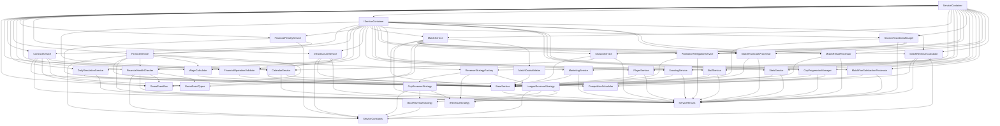

# Mapa de Dependências dos Serviços

Gerado automaticamente em 2025-12-10T17:34:28.177Z

```mermaid
graph TD
    BaseService --> ServiceResults
    CalendarService --> BaseService
    CalendarService --> ServiceResults
    CalendarService --> CompetitionScheduler
    ContractService --> BaseService
    ContractService --> ServiceResults
    ContractService --> GameEventBus
    ContractService --> GameEventTypes
    ContractService --> FinancialOperationValidator
    DailySimulationService --> BaseService
    DailySimulationService --> ServiceResults
    FinancialHealthChecker --> BaseService
    FinancialHealthChecker --> ServiceConstants
    FinancialHealthChecker --> ServiceResults
    FinancialHealthChecker --> GameEventBus
    FinancialHealthChecker --> GameEventTypes
    FinancialPenaltyService --> BaseService
    FinancialPenaltyService --> ServiceConstants
    FinancialPenaltyService --> FinanceService
    WageCalculator --> BaseService
    FinanceService --> ServiceConstants
    FinanceService --> BaseService
    FinanceService --> ServiceResults
    FinanceService --> FinancialHealthChecker
    FinanceService --> WageCalculator
    FinanceService --> RevenueStrategyFactory
    FinanceService --> GameEventBus
    InfrastructureService --> ServiceConstants
    InfrastructureService --> BaseService
    InfrastructureService --> ServiceResults
    InfrastructureService --> FinancialOperationValidator
    IServiceContainer --> CalendarService
    IServiceContainer --> ContractService
    IServiceContainer --> DailySimulationService
    IServiceContainer --> FinanceService
    IServiceContainer --> FinancialHealthChecker
    IServiceContainer --> FinancialPenaltyService
    IServiceContainer --> WageCalculator
    IServiceContainer --> InfrastructureService
    IServiceContainer --> MarketingService
    IServiceContainer --> MatchService
    IServiceContainer --> PlayerService
    IServiceContainer --> ScoutingService
    IServiceContainer --> SeasonService
    IServiceContainer --> PromotionRelegationService
    IServiceContainer --> SeasonTransitionManager
    IServiceContainer --> StaffService
    IServiceContainer --> StatsService
    IServiceContainer --> CupProgressionManager
    IServiceContainer --> MatchFanSatisfactionProcessor
    IServiceContainer --> MatchFinancialsProcessor
    IServiceContainer --> MatchResultProcessor
    IServiceContainer --> MatchRevenueCalculator
    MarketingService --> BaseService
    MarketingService --> ServiceResults
    CupProgressionManager --> BaseService
    CupProgressionManager --> ServiceResults
    CupProgressionManager --> CompetitionScheduler
    MatchFanSatisfactionProcessor --> BaseService
    MatchFanSatisfactionProcessor --> ServiceResults
    MatchFinancialsProcessor --> BaseService
    MatchFinancialsProcessor --> ServiceResults
    MatchResultProcessor --> BaseService
    MatchResultProcessor --> ServiceResults
    MatchRevenueCalculator --> BaseService
    MatchRevenueCalculator --> ServiceResults
    MatchRevenueCalculator --> ServiceConstants
    MatchRevenueCalculator --> RevenueStrategyFactory
    MatchService --> BaseService
    MatchService --> ServiceResults
    MatchService --> MatchResultProcessor
    MatchService --> MatchRevenueCalculator
    MatchService --> MatchFinancialsProcessor
    MatchService --> GameEventBus
    MatchService --> GameEventTypes
    MatchService --> MatchDataValidator
    PlayerService --> BaseService
    PlayerService --> ServiceResults
    ScoutingService --> BaseService
    ScoutingService --> ServiceResults
    PromotionRelegationService --> BaseService
    PromotionRelegationService --> ServiceResults
    SeasonTransitionManager --> BaseService
    SeasonTransitionManager --> ServiceResults
    SeasonTransitionManager --> PromotionRelegationService
    SeasonTransitionManager --> SeasonService
    SeasonService --> BaseService
    SeasonService --> CalendarService
    SeasonService --> ServiceResults
    ServiceContainer --> GameEventBus
    ServiceContainer --> CalendarService
    ServiceContainer --> ContractService
    ServiceContainer --> DailySimulationService
    ServiceContainer --> FinanceService
    ServiceContainer --> FinancialHealthChecker
    ServiceContainer --> FinancialPenaltyService
    ServiceContainer --> WageCalculator
    ServiceContainer --> InfrastructureService
    ServiceContainer --> IServiceContainer
    ServiceContainer --> MarketingService
    ServiceContainer --> MatchService
    ServiceContainer --> PlayerService
    ServiceContainer --> ScoutingService
    ServiceContainer --> SeasonService
    ServiceContainer --> PromotionRelegationService
    ServiceContainer --> SeasonTransitionManager
    ServiceContainer --> StaffService
    ServiceContainer --> StatsService
    ServiceContainer --> CupProgressionManager
    ServiceContainer --> MatchFanSatisfactionProcessor
    ServiceContainer --> MatchFinancialsProcessor
    ServiceContainer --> MatchResultProcessor
    ServiceContainer --> MatchRevenueCalculator
    StaffService --> BaseService
    StaffService --> ServiceResults
    StatsService --> BaseService
    StatsService --> ServiceResults
    BaseRevenueStrategy --> ServiceConstants
    CupRevenueStrategy --> ServiceConstants
    CupRevenueStrategy --> BaseRevenueStrategy
    CupRevenueStrategy --> IRevenueStrategy
    LeagueRevenueStrategy --> ServiceConstants
    LeagueRevenueStrategy --> BaseRevenueStrategy
    LeagueRevenueStrategy --> IRevenueStrategy
    RevenueStrategyFactory --> CupRevenueStrategy
    RevenueStrategyFactory --> IRevenueStrategy
    RevenueStrategyFactory --> LeagueRevenueStrategy
    FinancialOperationValidator --> BaseService
    MatchDataValidator --> BaseService
```