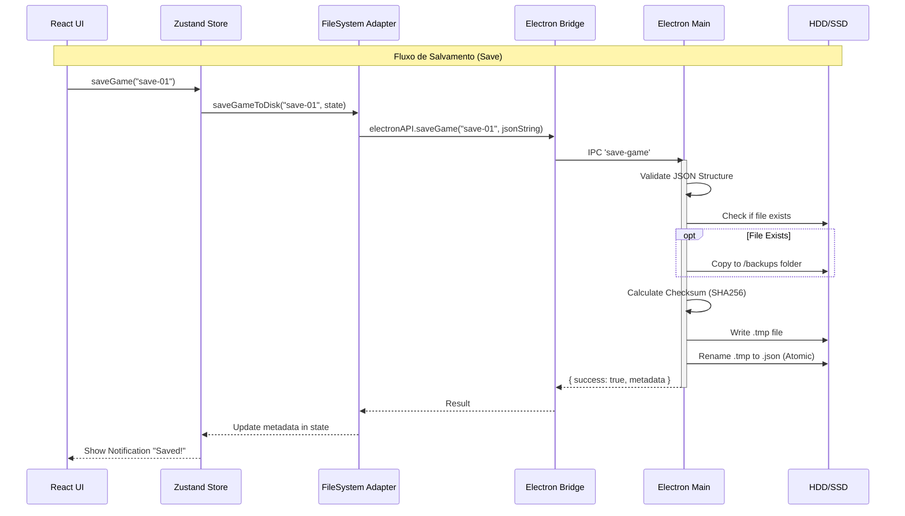

## 1. Visão Geral

O sistema de persistência do "Maestro" utiliza uma arquitetura **Single Source of Truth** baseada em arquivos JSON locais. A comunicação entre a interface (React/Renderer) e o Sistema de Arquivos (Node/Main) é feita através de uma ponte segura (IPC) que impede a injeção direta de código Node.js na camada de apresentação.

### Principais Funcionalidades

* **Agnosticismo de Plataforma:** Funciona em Desktop (Electron) e Web (LocalStorage para dev/fallback).
* **Segurança de Dados:** Uso de Checksums (SHA-256) para detetar corrupção de saves.
* **Prevenção de Perdas:** Sistema de backups automáticos rotativos (mantém os últimos 5) e escrita atômica (`.tmp` -> `.json`).
* **Metadados:** Separação entre dados do jogo e metadados (versão, data, tamanho) para listagem rápida sem carregar o save inteiro.

---

## 2. Arquitetura de Componentes

O fluxo de dados atravessa 4 camadas distintas:

### A. Camada de Estado (Store)

* **Arquivo:** `src/state/useGameStore.ts`
* **Responsabilidade:** Orquestra o pedido de salvamento. Prepara o objeto `GameState` (que está na memória RAM) e remove funções ou dados transitórios antes de enviar para a camada de dados.

### B. Camada de Adaptador (Data Layer)

* **Arquivo:** `src/data/fileSystem.ts`
* **Responsabilidade:** Abstrai a tecnologia de armazenamento. Verifica se o ambiente é Electron ou Web.
* **Web:** Usa `localStorage`.
* **Electron:** Chama `window.electronAPI`.


### C. Camada de Ponte (Bridge/Preload)

* **Arquivo:** `electron/preload.ts` e `src/electron-env.d.ts`
* **Responsabilidade:** Expõe métodos seguros via `contextBridge` para o mundo isolado do Renderizador. Traduz chamadas de função em eventos IPC (`ipcRenderer.invoke`).

### D. Camada de Sistema (Main Process)

* **Arquivo:** `electron/main.ts`
* **Responsabilidade:** Acesso real ao disco (`fs/promises`). Executa validações, criptografia, backups e gestão de arquivos.

---

## 3. Fluxo de Dados: Salvar Jogo (Save Flow)

O processo de salvamento segue um pipeline rigoroso para garantir a integridade dos dados.

1. **Trigger:** O utilizador clica em "Salvar" ou o Auto-Save dispara.
2. **Serialização:** O `useGameStore` converte o estado em um objeto Plain Object (removendo funções do Immer).
3. **Envio IPC:** O JSON (string) é enviado ao processo Main via `save-game`.
4. **Processamento no Main (`ipcMain.handle('save-game')`):**
* **Sanitização:** O nome do arquivo é limpo (`sanitizeFilename`) para evitar caracteres ilegais.
* **Validação:** Verifica se o JSON possui a estrutura mínima (`meta`, `clubs`, `players`).
* **Backup:** Se o arquivo já existe, cria uma cópia com timestamp na pasta `backups/` e apaga backups antigos (mantém max 5).
* **Metadados:** Calcula o SHA-256 do conteúdo e cria o objeto wrapper:
```json
{
  "metadata": { "version": "1.0.0", "checksum": "abc...", "timestamp": 123... },
  "gameState": { ... }
}

```


* **Escrita Atômica:**
1. Escreve em `save-game.json.tmp`.
2. Renomeia para `save-game.json` (garante que o arquivo nunca fique corrompido se o PC desligar durante a escrita).


---

## 4. Fluxo de Dados: Carregar Jogo (Load Flow)

1. **Solicitação:** A UI pede para carregar "save-game-01".
2. **Leitura no Main:**
* Lê o arquivo do disco.
* Separa `metadata` e `gameState`.
* **Verificação de Integridade:** Recalcula o hash do `gameState` lido e compara com `metadata.checksum`. Se diferir, emite um aviso de possível corrupção (mas permite carregar).


3. **Retorno:** Devolve o JSON stringificado ao Renderer.
4. **Hidratação:** O `useGameStore` recebe o objeto e substitui o estado atual da aplicação (`set(() => loadedState)`).

---

## 5. Estrutura de Arquivos no Disco

Os arquivos são salvos na pasta `userData` do sistema operacional (ex: `%APPDATA%/maestro-game/` no Windows).

```text
userData/
├── saves/                  # Saves ativos
│   ├── save-game-01.json
│   └── carreira-pro.json
└── backups/                # Backups automáticos de segurança
    ├── save-game-01_1715000000.backup.json
    ├── save-game-01_1715003600.backup.json
    └── ...

```

---

## 6. Referência da API (Electron Bridge)

Interface exposta globalmente em `window.electronAPI`:

```typescript
interface IElectronAPI {
  // Salva o estado atual. Retorna sucesso e novos metadados.
  saveGame: (filename: string, data: string) => Promise<SaveResult>;

  // Carrega um save. Retorna o JSON stringificado e metadados.
  loadGame: (filename: string) => Promise<LoadResult>;

  // Lista todos os arquivos .json na pasta de saves.
  listSaves: () => Promise<string[]>;

  // Remove um save permanentemente (após confirmação nativa).
  deleteSave: (filename: string) => Promise<SaveResult>;

  // Obtém apenas o cabeçalho (meta) sem ler o arquivo todo (rápido).
  getSaveInfo: (filename: string) => Promise<SaveMetadata | null>;

  // Abre a pasta de saves no Explorer/Finder nativo.
  openSavesFolder: () => Promise<void>;
}

```

---

## 7. Diagrama de Sequência (Mermaid)



---

## 8. Tratamento de Erros e Segurança

* **Validação de Estrutura:** O Main process verifica se o JSON contém as chaves primárias antes de salvar, evitando que um estado vazio sobrescreva um save válido.
* **Sanitização de Caminhos:** Impede que um nome de save malicioso (ex: `../../windows/system32`) acesse pastas fora do diretório permitido.
* **Confirmação de Exclusão:** A deleção de saves invoca um `dialog.showMessageBox` nativo do sistema operacional para evitar cliques acidentais.
* **Limpeza Automática:** Arquivos temporários (`.tmp`) que sobrarem devido a falhas anteriores são limpos na próxima tentativa de salvamento.